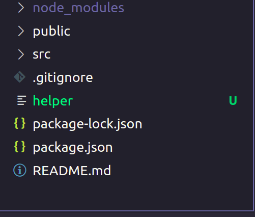
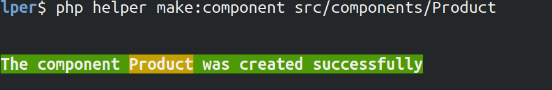
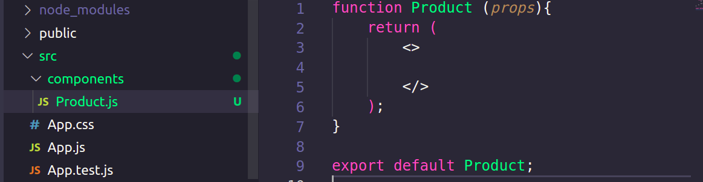
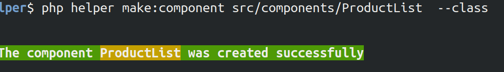
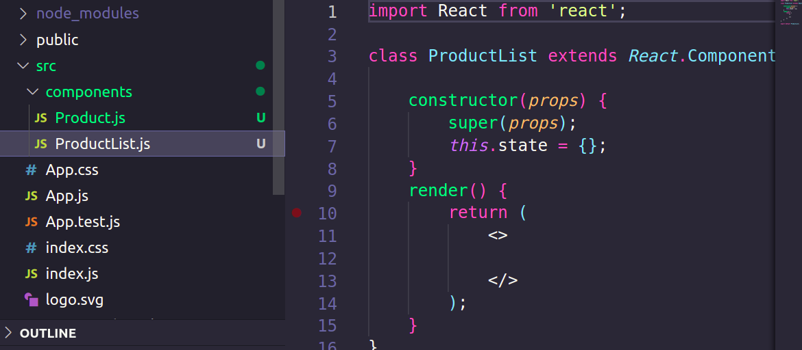
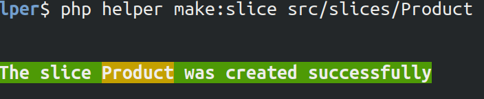
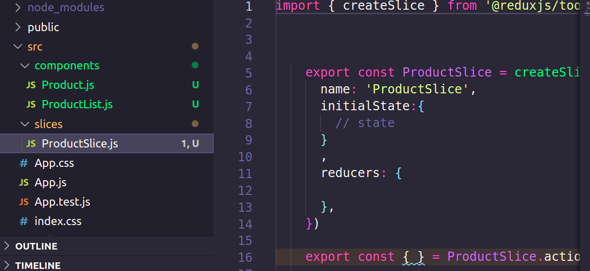

# React helper 

##### easy  create component and slice (one command)
# require : PHP

### use 
download file " helper " in root app directory  <br><br>


## Note :  delete file helper if project production 

## create component 

### EX : 

```bash
$ php helper make:component src/components/Product
```


create file  'src/components/Product.js' 
#### content file  
```js
function Product (props){
    return (
        <>
           
        </>
    );
}
export default Product;

```


## create class  component 
```bash
$ php helper make:component src/components/ProductList  --class
```

create file  'src/components/ProductList.js' 
#### content file  

```js
import React from 'react';

class ProductList extends React.Component {

    constructor(props) {
        super(props);
        this.state = {};
    }
    render() {
        return (
            <>
                
            </>
        );
    }
}

export default ProductList;
```

## create slice

```bash
$ php helper make:slice src/slices/Product
```



create file  ' src/slices/ProductSlice.js' 
#### content file 
```js 
    import { createSlice } from '@reduxjs/toolkit'

 
    
    export const ProductSlice= createSlice({
      name: 'ProductSlice',
      initialState:{
        // state 
      }
      ,
      reducers: {
        
      },
    })
    
    export const { } = ProductSlice.actions
    
    export default ProductSlice.reducer
```
 

